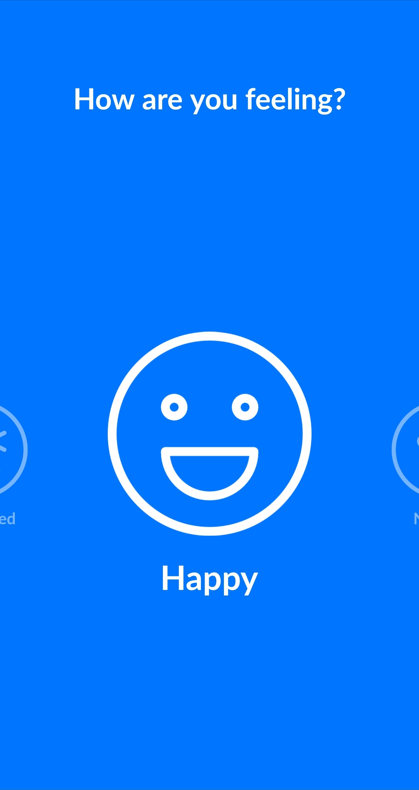
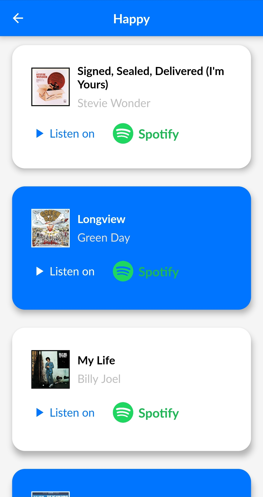
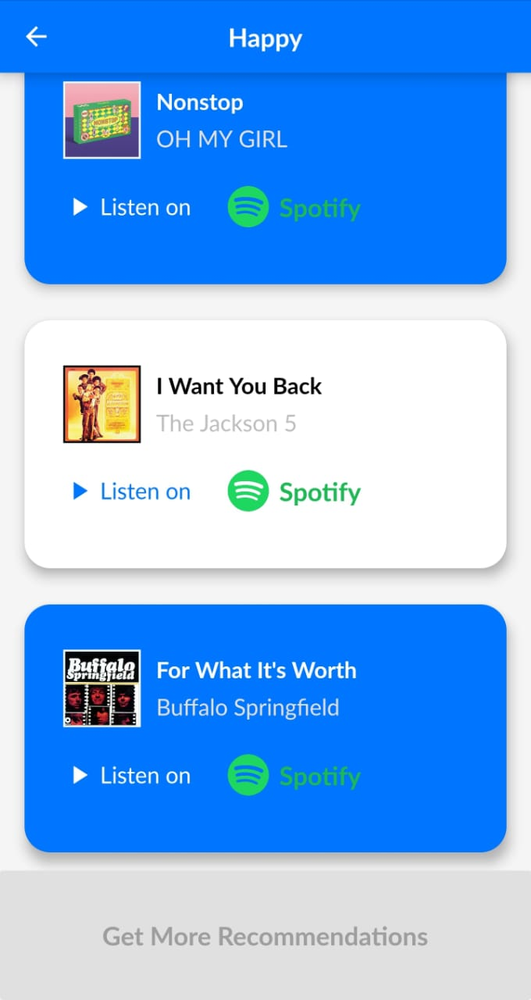
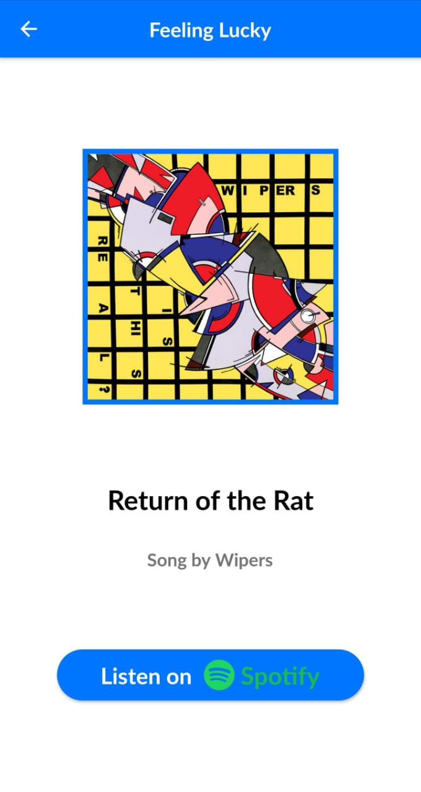

<h1 align="center"> <strong>Musiemotion</strong></h1>

  <strong>-- 😃 An Emotion-Based Music Recommendation System 😔 --</strong>

- Play Store (Android): https://play.google.com/store/apps/details?id=com.flarize.musiemotion&hl=en 

- iOS version coming soon!

# 📱 Front-End

## Using Flutter  , Provider and BLoC Pattern

[✔️] **Five** Different Emotion Options - **Happy  | Neutral  | Meh  | Down  | Frustrated **

[✔️] **Feeling Lucky** 🍀 Option for a Lucky Recommendation

[✔️] Song Recommendation Data Retrieval using **HTTP** 🌐 and the Dedicated [Back-End API](https://github.com/HossamElghamry/Musiemotion/blob/master/README.md#Back-End)

[✔️] **Spotify OAuth Access Token** 🔐 Authentication using **Client Credentials Flow** for **Album Art** 🖼️ Retrieval

[✔️] **Spotify Redirection** 🎧 to Listen to the Desired Recommendation

[✔️] Clean **BLoC** Architecture Implementation

[✔️] Full Utilization of **Provider**

[✔️] **Network Connectivity**🌐 Checking

[✔️] Easy-to-Follow **User Interface**

# 🖧 Back-End

## Using Python Flask , Heroku  and K-Means Clustering

Spotify Dataset Link: https://www.kaggle.com/yamaerenay/spotify-dataset-19212020-160k-tracks

[✔️] Data preprocessing and segmentation using **Python**

[✔️] Emotion Classification and Labeling using **K-Means Clustering**

[✔️] API Deployment using **Flask** and **Heroku** @ https://musiemotion.herokuapp.com/(Emotion)/(NumberOfRecommendationsNeeded)

[✔️] Data Representation in JSON format

# 🔧 Building Requirements

- Initiating **Enviroment Variables**

  - Create a _.env_ file in the root directory of your Flutter project
  - The _.env_ should include your Spotify for Developers App's **Client ID** and **Client Secret** in the following format:

        CLIENTID=<Your Client ID>
        CLIENTSECRET=<Your Client Secret>

### 🛑 **Disclaimers**

- No data is collected from the user nor the developer. The .env should be included in the .gitignore file when commiting
- The first data retrieval process will take up to one minute for the Heroku enviroment to initialize
- The normal recommendation retrieval process should not take more than 1 second

# 🗃️ To-Do List

[🔮] Recommendation List Sorting Based on Different Parameters (Popularity, Duration, etc...)

[🔮] More Emotions

[🔮] Error Handeling

# 🖻 Screenshots

    
